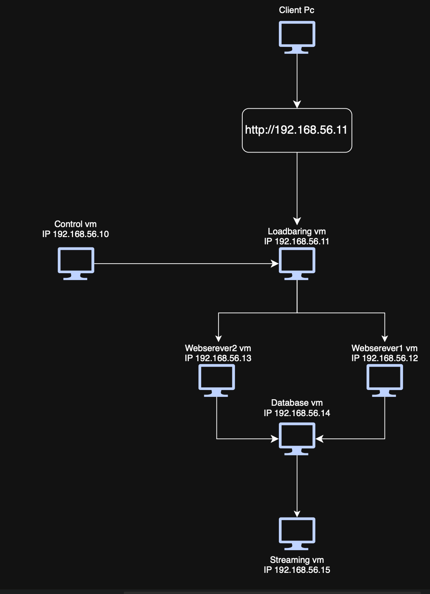

# **Streaming service**

> This project is a fully automated simulation of a simple streaming service with six VMs created with Vagrant and configured via Ansible. The entire infrastructure is reproducible. Running `vagrant up` followed by `ansible-playbook site.yml -v` inside the control VM will produce an identical environment from scratch, with no manual steps required beyond providing a `secrets.yml` file.
>
> The result can be verified by running `./verify.sh`, which automatically checks that all services are running and communicating correctly.

______
## **Table of contents**
- [Architecture](#Architecture)
- [Environment and IP addresses](#Environment-and-IP-addresses)
- [Map structure](#Map-structure)
- [Components](#Components)
- [Requirements and prerequisites](#Requirements-and-prerequisites)
- [Getting started](#Getting-started)
- [Security](#Security)
- [Security Analysis](#Security-Analysis)
- [Validation](#Validation)
- [Design and Architecture](#Design-and-Architecture)
- [Branch- and Patchnotes](#Branch--and-Patchnotes)

_________
## **Architecture**

____
## **Environment and IP addresses**

| VM        | Roll              | IP-address    | port forwarding   | Description                                                                                   |
| --------- | ----------------- | ------------- | ----------------- | --------------------------------------------------------------------------------------------- |
| Control   | Ansible Control   | 192.168.56.10 | -                 | Acts as the Ansible control node. It clones the project repository from GitHub on boot, generates an SSH key pair, and distributes the public key to all other VMs. No applications run here - it only manages the infrastructure.       |
| LB        | Loadbalancer      | 192.168.56.11 | : 80 -> host 8080 | Runs nginx as a load balancer, distributing incoming HTTP traffic on port 80 across the two web servers using round-robin. Accessible from the host machine at http://192.168.56.11.             |
| web1      | Web server | 192.168.56.12 | -                 | Runs a Flask application via Gunicorn on port 5000. Fetches video metadata from the database using SQLAlchemy and renders the Nitflix web page. Managed as a systemd service that starts automatically on boot.                                                                 |
| web2      | Web server | 192.168.56.13 | -                 | Identical to Webserver1. Runs the same Flask application via Gunicorn on port 5000. Together with Webserver1 it provides high availability and load distribution.                                                                 |
| database  | Database server    | 192.168.56.14 | -                 | Runs PostgreSQL on port 5432. Stores video metadata (title, filepath, upload date, views). Only accessible from within the private network. The web servers connect to it via SQLAlchemy. |
| streaming | Streaming server   | 192.168.56.15 | -                 | Runs nginx as a static file server and serving video files from /var/www/videos/ on port 80. The filepath stored in the database points here and the client's browser fetches the video directly from this VM.                                                 |

__________
## **Map structure**
```
repo/
├── Pictures/ 
│   └── Topology.png                    # Network topology diagram showing VM layout
│
├── Vagrant/
│   ├── Vagrantfile                     # Defines and creates all VMs, runs provision scripts
│   └── nitflix.mp4	                    # Video file copied to streaming VM on boot
│
├── ansible/
│   ├── ansible.cfg                     # Ansible settings: inventory path, host_key_checking, pipelining
│   ├── inventory.ini                   # Lists all VMs with IPs and groups (loadbalancer, webservers, etc.)
│   ├── site.yml                        # Master playbook — runs all roles in correct order
│   │
│   ├── vars/
│   │   ├── vars.yml                    # Non-sensitive variables: db_name, IP-addresses
│   │	└── secrets.example.yml         # Template showing structure of secrets.yml
│   │ 
│ 	 └── roles/              
│       ├── database/
│       │   ├── tasks/
│       │   │   └── main.yml            # Installs PostgreSQL, creates DB/user, runs seed.sql
│       │   ├── files/
│       │   │  	└── seed.sql            # Creates videos table, grants SELECT to nitflix_user, inserts test data
│       │   └── handlers/
│       │     	└── main.yml            # Restarts PostgreSQL when config changes
│       │
│       ├── loadbalancer/
│       │   ├── templates/
│       │ 	│ 	 └── nginx.conf.j2      # Nginx config — dynamically generates upstream block from inventory
│       │   ├── handlers/
│       │ 	│	  └── main.yml          # Reloads nginx when config changes
│       │   └── tasks/
│       │       └── main.yml            # Installs and configures nginx as load balancer
│       │
│       ├── streaming/
│       │   ├── tasks/
│       │   │   └── main.yml            # Installs and configures nginx as static file server
│       │   ├── handlers/
│       │   │   └── main.yml            # Reloads nginx when config changes
│       │   └── templates/
│       │       └── nginx.conf.j2       # Nginx config — serves video files from /var/www/videos/
│       │
│       └── webservers/
│           ├── tasks/
│           │   └── main.yml            # Installs Python, creates venv, copies app files, starts Flask
│           ├── files/
│           │  	├── requirements.txt    # Python dependencies: Flask, SQLAlchemy, psycopg2, Gunicorn
│           │  	├── app.py              # Flask app — fetches video data from PostgreSQL, renders HTML
│           │   ├── streming.css        # Stylesheet for the Nitflix web page
│           │  	└── templates/
│           │  	    └── index.html      # Jinja2 HTML template — displays video player with DB data
│           ├── handlers/
│           │  	└── main.yml            # Reloads systemd and restarts Flask when files change
│           └──templates/
│           	  └── flask.service.j2  # systemd service — autostart Flask/Gunicorn on boot
├── .gitignore                          # Excludes secrets.yml and unnecessary vagrant files from being uploaded to Github
└── README.md                           # Project documentation
  
```

___________

## **Components**

### **Vagrantfile**

Defines six virtual machines in VirtualBox with a private network (_192.168.56.0/24_). Port forwarding from the load-balancing VM maps port 80 to 8080, making the web application reachable from the Windows host. The database server does not have any port forwarding deliberately, to keep it unreachable from outside.

### **ansible.cfg**

Points to the `inventory.ini` file and enables SSH connections for Ansible control with `host_key_checking = False` (this is only suitable in lab environments). `roles_path = ./roles` to point to the files for the roles.

### **Inventory.ini**

Groups the different servers into (_Loadbalancing_), (_Database_), (_Webservers_), (_Streaming_), and (_Control_). This is done with IP addresses.

### **Site.yml**

Master playbook for Ansible that points to `vars/vars.yml` and couples the roles to the different groups defined in `inventory.ini`.
This file also controls the order in which the roles are run:

- `1.streaming` - configures the streaming VM
- `2.database` - configures the database VM to create the database table
- `3.webservers` - configures both of the web server VMs
- `4.loadbalancer` - configures the load balancing VM

The streaming VM is configured first because the database uses a URL it creates. In reality it would probably not matter, but it is a precaution. After the streaming VM and the database VM are configured, the web servers are configured because they both rely on the database and streaming server to work. Lastly the load balancer is configured because it needs the web servers up and running.

### **Role loadbalancer**
The load balancer role installs and configures Nginx to redirect all traffic to the web servers, this allows the web servers to share the load for the site. It gets the web server IPs from the `inventory.ini` file. The load balancer is configured with a `50/50` balance, meaning both web servers receive `50%` of the incoming traffic. This can be changed by editing the `/templates/nginx.conf.j2` file.

### **Role Webservers**
The web server role installs all the programs listed in `/files/requirements.txt` and configures Gunicorn and Flask. It also uses the Python library SQLAlchemy to connect the database table in `seed.sql` to the Flask `app.py` and the `index.html` that is loaded in the Flask app. This makes the HTML file able to load values from the database with out php code.

### Role Streaming
The streaming role installs and configures Nginx for the purpose of acting as a streaming server. It listens on port `80` and uses the `Accept-Ranges bytes` header which allows the browser to request the video in small chunks, enabling the video to play while it is still loading. It creates a folder called `/var/www/videos` where all the videos are stored, and all files placed in that folder become available to stream if they are the correct format.

### Role Database
The database role installs PostgreSQL and creates a database table with the `seed.sql` file with these columns:

- `id` SERIAL PRIMARY KEY
- `videotitle` VARCHAR(255) NOT NULL
- `filepath` VARCHAR(255) NOT NULL
- `uploadeddate` DATE NOT NULL
- `views` INTEGER DEFAULT 0

In the `seed.sql` file the permissions are also set so the web servers can access the table. The information inserted into the table is:

- `videotitle` How to Nitflix and Chill
- `filepath` [http://192.168.56.15/videos/nitflix.mp4](http://192.168.56.15/videos/nitflix.mp4)
- `uploadeddate` 1969-07-06
- `views` 67

The reason no `id` is inserted is because the `id` column in a SQL database often uses auto increment, meaning the value increases by itself. If a database table already exists it does nothing.

### **Flask application (app.py)**
The Flask application is simple with two endpoints:

- `/` Returns the `index.html` file that contains the entire website.
- `/health` Simple health check for the Flask application.

The Flask application also uses the SQLAlchemy Python library to connect the database table to the Flask application. This is done via the 

```python
app.config["SQLALCHEMY_DATABASE_URI"] = (
    f"postgresql://{DB_USER}:{DB_PASS}@{DB_HOST}/{DB_NAME}"
)
db = SQLAlchemy(app)
```

Command and the variables are stored in the `vars/vars.yml` and `secrets.yml` files. There is also a fallback hardcoded variable in `DB_HOST`, so in the case that the `db_host` variable is somehow empty it falls back to `192.168.56.14`, which is the IP address of the database VM.

________

## **Requirements and prerequisites**

#### **Programs that must be installed on the Windows host for this project to work.**

- [VirtualBox ](https://www.virtualbox.org) — Tested using version 7.2.6 r172322
- [Vagrant](https://developer.hashicorp.com/vagrant) — Tested using version 2.4.9
- [Git](https://git-scm.com/install/windows)

### **Hardware requirements**

- At least 16 GB of RAM (The project uses a total of ~6 GB RAM)
- At least 20 GB of free disk space

#### **Secrets file:**

Creates a `secrets.yml` file in `vagrant/secrets.yml` based on the template  
`secrets.example.yml`

________

## **Getting started**
```bash
# 1. clone the github repo via either ssh or https

# ssh
git clone  git@github.com:A-Hagman/ITS25-School-project-Load-balanced-Video-Streaming-Server.git

# https
git clone https://github.com/A-Hagman/ITS25-School-project-Load-balanced-Video-Streaming-Server.git

cd "ITS25-School-project-Load-balanced-Video-Streaming-Server"

# 2. create the secrets-file
create a secrets.yml based on the secrets.example.yml file

# 3. start all of the VMs
cd vagrant 
vagrant up

# 4. ssh into the ansible controlnode
vagrant ssh control

# 5. execute the ansible playbook
cd /home/vagrant/project/ansible
ansible-playbook site.yml -v

# 6. validate
cd /home/vagrant/project/ansible

./verify.sh
```

### **Expectations**
Open `http://192.168.56.11` in a browser. You should be able to see the website Nitflix and be able to watch the test video on the site. The site should retrieve the information that is stored in the database VM where the videos url is stored from the streaming VM.

---
## **Secrets**

The file `/vagrant/secrets.yml` must be created locally and is never committed to GitHub because it contains sensitive information like passwords, and is therefore excluded from being committed to GitHub via the `.gitignore` file.

Copy the variables from the example secrets file and fill in real values.

The file should be available via on the control node via the shared vagrant folder .`vagrant`.

---
## **Security**

#### **Principle of Least Privilege (database)**
The database user "nitflix_user" is granted only SELECT permissions on the videos table. The Flask application cannot write, modify or delete data in the database — even if the application were to be compromised, an attacker would have read-only access to the video metadata.

#### **Secrets management**
Database credentials (db_user and db_password) are stored in secrets.yml, which is excluded from version control via .gitignore. A secrets.example.yml file is committed instead, showing the required structure without exposing real values. This prevents sensitive information from being stored in the Git history.

#### **Private network and network segmentation**
All VMs communicate over an isolated host-only network (192.168.56.0/24). The database VM has no port forwarding and is not reachable from outside the private network. Access to the database is restricted at the application level through PostgreSQL's pg_hba.conf, which only permits authenticated connections from within the subnet. Note that no firewall (UFW) is configured — all ports are currently open between VMs on the internal network. This is identified as a security gap in the Security Analysis section.

#### **SSH key-based authentication**
The Ansible control node authenticates to all other VMs using an ed25519 key pair generated automatically at boot. Password-based SSH authentication is never used. *Note that host_key_checking = False is set in ansible.cfg — read Shortcoming 6 in the next part for more information about this.

#### **Service isolation**
Each service runs on a dedicated VM. If a web server is compromised, the attacker does not have direct access to the database or streaming server.

---
## **Security Analysis**
### Remaining shortcomings

#### **Shortcoming 1: No firewall rules**
The project currently has no firewall rules, meaning the Windows host can communicate directly with both the streaming VM and the database VM. This is not ideal as it could allow an attacker to manipulate or steal data stored on those servers.

To mitigate this, firewall rules should be implemented to restrict direct access to the streaming and database VMs from outside the internal network.

This risk is accepted because this is a lab environment and is only meant to demonstrate how a basic streaming service is structured, but if we had had more time we would definitely have added at least basic firewall rules to the project.

####  **Shortcoming 2:  No DRM protection**
The current streaming server does not have DRM protection for the videos, making it possible for anyone to go into the site and download the source file directly from the streaming VM, making it quite easy to steal the hosted content.

To mitigate this we could implement token-based URL signing, which is available in Nginx. However this is not used on real streaming servers as they use more complex solutions like Google Widevine or Apple FairPlay. Token-based URL signing would still make it significantly harder to simply download the source video directly.

This risk is accepted because this is a lab environment and is only meant to demonstrate how a basic streaming service is structured, if we hade had more time we would have added token-based URL signing with Nginx for basic DRM protection.

#### **Shortcomings 3: Poor logging**
Flask logs are automatically collected by journald through systemd with no additional configuration required. When the flask.service systemd unit is running, all output from Flask and Gunicorn (including errors, requests and stack traces) is captured and stored automatically on each web server.

While journald captures Flask and Gunicorn output locally, logging coverage across the system is limited. Logs are stored on each individual VM with no centralized collection, meaning an administrator would need to SSH into each machine separately to investigate an incident. nginx access logs on the load balancer and streaming server are not monitored or forwarded, and PostgreSQL is not configured to log queries or failed authentication attempts. There are also no automated alerts if a service goes down or behaves unexpectedly — verify.sh provides a manual snapshot but is not a substitute for continuous monitoring. In a production environment, a centralized solution such as the ELK stack or Grafana Loki would be used to collect and correlate logs from all services in one place, with automated alerting on anomalies.

This risk is accepted because this is a lab environment and is only meant to demonstrate how a basic streaming service is structured.

#### **Shortcomings 4: Missing intrusion detection and file integrity monitoring**
The system currently has no network-based intrusion detection or file integrity monitoring in place. A tool such as *Snort* could be deployed on the load balancer to monitor incoming network traffic and alert on suspicious patterns.

Similarly, *AIDE* (Advanced Intrusion Detection Environment) could be used to monitor critical system files on each VM for unexpected changes. If an attacker were to gain access and modify configuration files, binaries or the Flask application itself, there would currently be no mechanism to detect it. In a production environment, both tools would be considered baseline security controls.

As this is a lab environment, proceeding without these systems is accepted.

#### **Shortcoming 5:  Only one Streaming server**
The current architecture has a single point of failure on the streaming server, if that VM goes down the entire streaming service goes down.

To mitigate this risk, a load balancing VM and an additional streaming server VM could be implemented, so that one VM can go down without the entire service stopping. If possible, a failover load balancing VM could also be added for both the web server VMs and streaming server VMs to make the system even more redundant.

This risk is accepted because this is a lab environment and is only meant to demonstrate how a basic streaming service is structured, and because we did not have the resources to run all those VMs.

#### **Shortcoming 6: host_key_checking = False**
Currently we have `host_key_checking = False` which allows the Ansible controller to reach the other VMs. Without it the Ansible controller could not reach them because its SSH key could not be verified, as we do not have a certificate authority to verify the SSH keys.

To mitigate this risk we would have to set up a certificate authority VM in this lab environment to authenticate the SSH keys of the VMs.

This risk is accepted and deliberate because this is a lab environment and is only meant to demonstrate how a basic streaming service is structured and not how a certificate authority works, and because without it the Ansible controller cannot reach the other VMs.
____

## **Validation**

To validate that everything is working correctly, run the automated validation script.

```bash
cd home/vagrant/project/ansible

./verify.sh
```

The script validates the following
- That Ansible pings all the VMs
- That Nginx answers on the load balancing port `80`
- That Flask answers on both web servers on port `5000`
- That round-robin works (two calls give different host names)
- That the database is available from the control node
- That the streaming server answers on port `80`
- That Flask returns HTML (and not a 500 error)
- That the systemd services are running on the correct VMs

#### **Expected Output**
```bash
══ 1. Ansible connection (ping) ══
[OK]   Ansible ping → 192.168.56.11
[OK]   Ansible ping → 192.168.56.12
[OK]   Ansible ping → 192.168.56.13
[OK]   Ansible ping → 192.168.56.14
[OK]   Ansible ping → 192.168.56.15

══ 2. Systemd services ══
[OK]   flask.service active → 192.168.56.12
[OK]   flask.service active → 192.168.56.13
[OK]   nginx.service active → 192.168.56.11
[OK]   nginx.service active → 192.168.56.15
[OK]   postgresql.service active → 192.168.56.14

══ 3. HTTP-response from Flask (webbservers) ══
[OK]   Flask /health HTTP 200 → 192.168.56.12:5000
[OK]   Flask /health HTTP 200 → 192.168.56.13:5000

══ 4. Load balancing (round-robin) ══
[INFO] Curl 1 → webserver1 (192.168.56.12)
[INFO] Curl 2 → webserver2 (192.168.56.13)
[INFO] Curl 3 → webserver1 (192.168.56.12)
[INFO] Curl 4 → webserver2 (192.168.56.13)
[OK]   Round-robin confirmed — responses alternate between servers

══ 5. HTML-response via the load balancer ══
[OK]   Loadbaring returns HTTP 200
[OK]   HTML contain 'Nitflix'

══ 6. Database accessible from web servers ══
[OK]   PostgreSQL port 5432 reachable from webserver1

══ 7. Streaming server ══
[OK]   Video file available on the streaming server (HTTP 200)

══ Summary ══

  Approved:    17 / 17
  Failed:  0 / 17

 All checks passed — Nitflix is ready!
```
____

## **Design and Architecture**

### **Why we chose to use Hypervisor instead of Containers**
This project uses a Type 2 hypervisor (VirtualBox via Vagrant) rather than containers (e.g. Docker). Hypervisors virtualize entire machines where each VM has its own kernel, OS and network stack. This is providing strong isolation between services. A compromised web server does not share a kernel with the database which would not be guaranteed in a container-based setup where all services share the host kernel.

Containers would have been a valid choice for the Flask application itself, but achieving the same level of network segmentation and service isolation that Vagrant provides out of the box would have required an orchestrator such as Kubernetes. The trade-off is resource efficiency as each VM consumes a fixed 1024 MB of RAM regardless of actual load whereas containers would use significantly less. This is an acceptable trade-off in a lab environment focused on infrastructure architecture rather than resource efficiency.

### **Why are there two web servers and a load balancer?**
If we had only used one web server and no load balancer, that would have made the project easier, but we decided to add some more complexity by doing that to simulate how a real streaming service is set up. We also could have added another streaming server and a load balancer to have something even more like a real streaming service, but we decided not to do that.

The setup also allows one of the web servers to be taken down by, for example, a cyber attack without completely shutting down the site.

### **Why do we have a separate streaming server and not just use the database?**
By having a separate streaming server, it makes scaling the operation easier, as databases are quite hard to scale and it does not put unnecessary strain on the database when the site is in use. Databases are also quite bad at serving large files, which can result in the site becoming slower.

It may also add some extra layers of protection to both the streaming server and database when configured correctly.

### **Why do we use Gunicorn and SQLAlchemy?** 
Gunicorn, or **Green Unicorn**, is a Python based web server program that works with Flask. Gunicorn can handle multiple requests at the same time and allows for multiple workers on the same CPU core, making it generally faster and more reliable than just a Flask application. Gunicorn sits in front of the Flask application, allowing you to use a normal Flask application with Gunicorn to gain its benefits. Therefore we decided to use it in our project to make the Flask application faster and more reliable.

SQLAlchemy is a Python based library that allows you to use Python code to interact with a database instead of using raw SQL queries. We use SQLAlchemy to allow the Flask application to request the necessary information from the database VM, like video title, views, and the streaming URL. 

Flask does not allow you to natively use a SQL database, so either way we would have needed a library, but we decided on SQLAlchemy because it uses Python code and not SQL code, and we are better at Python than SQL.

### **Why do we use Nginx for both the load baring vm and the streaming vm**
We use Nginx on both the load balancing VM and the streaming VM. For the load balancing VM, Nginx is one of the most widely used tools for that purpose in the world, being easy to install and configure, and relatively lightweight and fast, making it an extremely good tool for that role.

For the streaming VM we chose it because Nginx has a technique called sendfile, which allows it to send a file over the network without copying it through the application first, making it really efficient at sending large static files, which is exactly what a streaming service needs.

____
*Skapad av: [Anton Hagman, William Åström]*  
*Kurs: Virtualiseringsteknik*  
*Datum: [2026-05-12]*

___

## *Branch- and Patchnotes*

## 01-added-vagrantfile
     - Created empty vagrant file
 
## 02-added-webserver-vm-1-and-2
     - Webserver 1 and 2 added to vagrant file
 
## 03-added-.gitignore
     - Added working .gitignore-file
 
## 04-added-rest-of-vm-to-vagrantfile
     - Added control vm, Loadbaring vm, Database vm and streaming vm
 
## 05-asnible-file-strukter
     - Added ansible files needed for basic functions
 
## 06-add-gitclone-to-vagrantfile
     - Added gitclone code to vagrant file
 
## 07-added-inventory.ini
     - Added inventory.ini with ip-adresses and ssh-key adress
     - # Added in vagrant file to pull branch 07
       git clone -b 07-added-inventory.ini https://github.com/A-Hagman/ITS25-School-project-Load-balanced-Video-Streaming-Server.git /home/vagrant/project

### Tested with:

**In powershell:**
 
*vagrant ssh control*
*vagrant@control:~$ cd "/home/vagrant/project/ansible"*
 
*vagrant@control:~/project/ansible$ ssh-keyscan -H 192.168.56.11 >> ~/.ssh/known_hosts*
*vagrant@control:~/project/ansible$ ssh-keyscan -H 192.168.56.12 >> ~/.ssh/known_hosts*
*vagrant@control:~/project/ansible$ ssh-keyscan -H 192.168.56.13 >> ~/.ssh/known_hosts*
*vagrant@control:~/project/ansible$ ssh-keyscan -H 192.168.56.14 >> ~/.ssh/known_hosts*
*vagrant@control:~/project/ansible$ ssh-keyscan -H 192.168.56.15 >> ~/.ssh/known_hosts*
 
*vagrant@control:~/project/ansible$ ansible all -i inventory.ini -m ping*
 
### Expected results:
 
192.168.56.11 | SUCCESS => {
    "ansible_facts": {
        "discovered_interpreter_python": "/usr/bin/python3"
    },
    "changed": false,
    "ping": "pong"
}

192.168.56.12 | SUCCESS => {
    "ansible_facts": {
        "discovered_interpreter_python": "/usr/bin/python3"
    },
    "changed": false,
    "ping": "pong"
}

192.168.56.13 | SUCCESS => {
    "ansible_facts": {
        "discovered_interpreter_python": "/usr/bin/python3"
    },
    "changed": false,
    "ping": "pong"
}

192.168.56.15 | SUCCESS => {
    "ansible_facts": {
        "discovered_interpreter_python": "/usr/bin/python3"
    },
    "changed": false,
    "ping": "pong"
}

192.168.56.14 | SUCCESS => {
    "ansible_facts": {
        "discovered_interpreter_python": "/usr/bin/python3"
    },
    "changed": false,
    "ping": "pong"
}

### Comment(s):
 
We had to ssh-keyscan to avoid the system asking "Are you sure you want to continue connecting (yes/no/[fingerprint])?" for each ping which caused the system to hang after the first ping. To avoid this we will add this code in the vagrant file after the key has been generated but before the ansible-playbook runs:
 
**Wait for each VM to come online before adding to known_hosts**   
for ip in 192.168.56.11 192.168.56.12 192.168.56.13 192.168.56.14 192.168.56.15; do
      echo "Väntar på $ip..."
      until nc -z -w 3 $ip 22; do
         sleep 3 
      done 
      ssh-keyscan -H $ip >> /home/vagrant/.ssh/known_hosts
    done
    chown vagrant:vagrant /home/vagrant/.ssh/known_hosts
 
 
We will also add netcat to automatically install to enable the loop to work:
 
**Installs Ansible and Github-git on boot up**      
apt-get install -y ansible git netcat-openbsd
 
 
Another solution would be to change the inventory.ini-file to not enable "StrictHostKeyChecking", which automatically accepts all hostkeys without asking. This would solve the same problem, but that would also compromise the security due to disabling the SSH-keyverification permanently. The known_host solution is saving the keys during start-up and if the keys changes och gets manupilated the SSH will alarm - which is much safer.
 
 
### UPDATE:
Due to problems with the loop not finding the VMs after creating the control node we changed to using vagrants SSH-keys instead of our own. This led to changes in both the vagrant file and the inventory.ini.
 
We removed the key-generating code in Vagrant aswell as moving the creation of the control to run last. The loop we added earlier we deemed unnecessary if we're working with vagrants own keys. We added paths to Vagrants keys in the inventory.ini.

### UPDATE 2:
The last changes did not work and after consulting the teacher we opted for "Host_key_checking = False" in the inventory.ini. This is not a "safe" method bud is will help us with the problem that occured when pinging. We also went back to using our own SSH-keys.

### UPDATE 3 (Final):
The "Host_key_checking = False" was not supposed to be in inventory.ini, it was supposed to be in the ansible.cfg. We moved the code to the right file. Added "ansible_python_interpreter=/usr/bin/python3" to the inventory.ini to specify what version of python we are using. We also corrected some big and small letters, added "chmod 755 /home/vagrant/project" and removed the "export ANSIBLE_CONFIG=/path/to/ansible.cfg" cause it was both typed wrong and does not help us cause we are mixing both Windows and Ubuntu.

This resulted in working pings between Control to all VMs! This concludes this branch.

## 08-Loadbalancer-VM
     - Updated tasks/main.yml with remove default site
     - Added /handlers/main.yml
     - Added /templates/nginx.conf.j2
     - Changed all "Loadbaring"-names to "Loadbalancer"

## 09-Webbserver-1-VM 
Clarification: This branch is for both webserver1 and webserver2

     - Created roles/webserver/files/requirements.txt
     - Created roles/webserver/files/app.py 
       (simplified version to test functionality - it will only return hostname to verify loadbalancer without a database)
     - Created roles/webserver/tasks/main.yml
     - Created roles/webserver/templates/flask.service.j2
     - Created roles/webserver/handlers/main.yml
     - Updated site.yml to include webservers

### Verification:
  **Run playbook**
  ```
ansible-playbook site.yml -v
```

  *failed=0 after playbook is running*

  **Check if flask is active on webserver1**
  ```
ansible webservers -m command -a "systemctl status flask"
```

  **Test through loadbalancer**
  ```
curl http://192.168.56.11/
curl http://192.168.56.11/health
  ```

  *Expected result:*
 ```
<h1>Hej fran webserver1!</h1>
{"hostname": "webserver1", "status": "ok"}
```

## 10-Database-VM
     - Created roles/database/files/seed.sql
     - Created roles/database/tasks/main.yml
     - Created roles/database/handlers/main.ym
     - Replaced roles/webserver/files/app.py with the full version that uses SQLAlchemy
     - Updated roles/webserver/templates/flask.service.j2 with database details in Environment.
       (this refers to /vars/vars.yml and /vars/secrets.yml)
     - Updated site.yml to include the database (running first)
     - Added code to vagrant file to copy secrets.yml from /vagrant/ to
       /home/vagrant/project/ansible/vars/secrets.yml

## 11-Streaming-VM
     - Created roles/streaming/tasks/main.yml
     - Created roles/streaming/handlers/main.yml
     - Created roles/streaming/templates/nginx.conf.j2
     - Updated site.yml to include the streaming VM
     - Added code to vagrant file to create /var/www/videos and copy the .mp4-file from /vagrant/

 ### Verification:
  **Run playbook**
  ```
ansible-playbook site.yml -v
```

  **Verify that the streaming-server is serving files**
  ```
curl -I http://192.168.56.15/videos/nitflix.mp4
```
*Expected result:*
```
HTTP/1.1 200 OK
Content-Type: video/mp4
```

  **Verify the entire chain via the loadbalancer**
  ```
curl http://192.168.56.11/
```
*Expected result:*
```
Nitflix HTML page with the video player
```

  **Verify through web browser**
```
http://192.168.56.11
```
*Expected result:*
```
Nitflix webpage that allows to play the video (.mp4)
```

## 12-Verification-Script
     - Added verification script (/ansible/verify.sh)
     - Changed vagrant file to allow access to /ansible/verify.sh

### Verification:
  **After running playbook, run:**
  ```
./verify.sh
```

*Expected result:*

```
══ 1. Ansible connection (ping) ══
[OK]   Ansible ping → 192.168.56.11
[OK]   Ansible ping → 192.168.56.12
[OK]   Ansible ping → 192.168.56.13
[OK]   Ansible ping → 192.168.56.14
[OK]   Ansible ping → 192.168.56.15

══ 2. Systemd services ══
[OK]   flask.service active → 192.168.56.12
[OK]   flask.service active → 192.168.56.13
[OK]   nginx.service active → 192.168.56.11
[OK]   nginx.service active → 192.168.56.15
[OK]   postgresql.service active → 192.168.56.14

══ 3. HTTP-response from Flask (webbservers) ══
[OK]   Flask /health HTTP 200 → 192.168.56.12:5000
[OK]   Flask /health HTTP 200 → 192.168.56.13:5000

══ 4. Load balancing (round-robin) ══
[INFO] Curl 1 → webserver1 (192.168.56.12)
[INFO] Curl 2 → webserver2 (192.168.56.13)
[INFO] Curl 3 → webserver1 (192.168.56.12)
[INFO] Curl 4 → webserver2 (192.168.56.13)
[OK]   Round-robin confirmed — responses alternate between servers

══ 5. HTML-response via the load balancer ══
[OK]   Loadbaring returns HTTP 200
[OK]   HTML contain 'Nitflix'

══ 6. Database accessible from web servers ══
[OK]   PostgreSQL port 5432 reachable from webserver1

══ 7. Streaming server ══
[OK]   Video file available on the streaming server (HTTP 200)

══ Summary ══

  Approved:    17 / 17
  Failed:  0 / 17

 All checks passed — Nitflix is ready!
```
 Note: *This is after changes in branch 13-Clean-up to better visualize round-robin*
 
## 13-Clean-up
     - Removed /roles/control-map due to not being used
     - Translated all language to English
     - Added comments on some files that needed extra clarifications
     - Changed section/test 4 in the verification script to better visualize the curl command (round-robin) working
     - Removed /health from /roles/loadbalancer/templates/nginx.conf.j2 due to it creating errors on test 4 when running verification script
     - Changed clone-location in vagrant file to main instead of this branch before final merge with main

